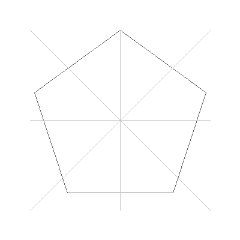

# Лабораторные работы по компьютерной графике

Проект содержит реализацию лабораторных работ по компьютерной графике на Java.

## Структура проекта

```
labs/
├── Lab1.java  - Смешивание изображений
├── Lab2.java  - Алгоритм рассеивания ошибки (Floyd-Steinberg)
├── Lab3.java  - Построение и заполнение полигонов
├── Lab4.java  - Кривые Безье, отсечение отрезков
└── Lab5.java  - 3D проекции и анимация (TODO)
```

## Запуск лабораторных работ

```bash
cd labs
java Lab1.java  # Лабораторная работа №1
java Lab2.java  # Лабораторная работа №2
java Lab3.java  # Лабораторная работа №3
java Lab4.java  # Лабораторная работа №4
```

---

## Лабораторная работа №1: Смешивание изображений

### Задание

1. Реализовать вывод на экран круглого полутонового изображения.
2. Реализовать смешивание (blending) двух изображений 8 bpp одинакового размера, используя в качестве альфа-канала третье изображение 8 bpp.

**Дополнительные задачи:**
- Использовать для смешивания цветовую систему HSV
- Реализовать обобщённую формулу смешивания изображений
- Выполнить зеркальное отражение и транспонирование изображения

### Реализация

#### Основной функционал

**1. Создание круглого полутонового изображения**

Метод `createCircularGrayscaleImage()` создает изображение с радиальным градиентом:
- Вычисляется расстояние от каждого пикселя до центра окружности
- Интенсивность пикселя зависит от расстояния: `intensity = 255 * (1 - distance/radius)`
- Пиксели вне окружности заполняются черным цветом

**2. Смешивание изображений с альфа-каналом**

Метод `blendImages()` реализует классическую формулу альфа-композитинга:

```
result = img1 * (1 - alpha) + img2 * alpha
```

Алгоритм:
1. Извлекаются значения яркости из трех изображений (8 bpp)
2. Альфа-значение нормализуется к диапазону [0, 1]
3. Вычисляется взвешенная сумма двух исходных изображений
4. Результат ограничивается диапазоном [0, 255]

**3. Дополнительные функции**

- `flipHorizontal()` - зеркальное отражение по горизонтали
- `transpose()` - транспонирование изображения (поворот на 90° с отражением)

#### Визуализация

Программа отображает 4 изображения в одном окне:
- Верхний левый: исходное изображение №1 (круговой градиент)
- Верхний правый: исходное изображение №2 (вертикальный градиент)
- Нижний левый: альфа-канал (круговая маска)
- Нижний правый: результат смешивания

#### Технические детали

- Тип изображений: `BufferedImage.TYPE_BYTE_GRAY` (8 bpp)
- Размер тестовых изображений: 400x400 пикселей
- Операции выполняются попиксельно с целочисленной арифметикой

#### Результат работы с синтетическими изображениями


### Работа с реальными фотографиями

#### 1. Применение круговой маски

Реализован функционал для обработки реальных фотографий с применением круговой маски.

**Метод `applyCircularMask(BufferedImage img)`:**
- Вписывает максимальный круг в изображение любого размера
- Радиус круга: `radius = min(width, height) / 2`
- Центр круга: `(width/2, height/2)`
- Конвертирует изображение в градации серого (8 bpp)
- Содержимое внутри круга сохраняется с правильной яркостью
- Область за пределами круга заполняется черным фоном
- Использует `WritableRaster` для корректной работы с TYPE_BYTE_GRAY

**Формула преобразования в оттенки серого:**
```java
gray = 0.299 * R + 0.587 * G + 0.114 * B
```

**Исправление проблемы затемнения:**
Изначальная реализация использовала `setRGB()` для TYPE_BYTE_GRAY изображений, что приводило к некорректной записи значений яркости. Исправлено путем использования `WritableRaster.setSample()` для прямой записи в канал яркости.

| Оригинал | Круговая маска |
|----------|----------------|
|  |  |

#### 2. Зеркальное отражение

**Метод `flipHorizontal(BufferedImage img)`:**
- Отражает изображение по горизонтали
- Результат конвертируется в grayscale (8 bpp)

| Оригинал | Зеркальное отражение |
|----------|----------------------|
|  |  |

#### 3. Транспонирование

**Метод `transpose(BufferedImage img)`:**
- Транспонирует изображение (поворот на 90° с отражением)
- Результат: 400x600 пикселей (было 600x400)

#### 4. Смешивание двух фотографий с альфа-каналом

**Демонстрация:**
- Первое изображение: оригинальная фотография
- Второе изображение: зеркально отраженная версия
- Альфа-канал: круговой градиент от центра к краям
- Формула: `result = img1 * (1 - alpha) + img2 * alpha`

| Результат смешивания |
|---------------------|
|  |

**Использование:**
```java
// Круговая маска
BufferedImage originalImage = Lab1.loadImage("res/test_img.png");
BufferedImage circularImage = Lab1.applyCircularMask(originalImage);
Lab1.saveImage(circularImage, "res/test_img_circular.png");

// Зеркальное отражение
BufferedImage flipped = Lab1.flipHorizontal(originalImage);
Lab1.saveImage(flipped, "res/test_img_flipped.png");

// Транспонирование
BufferedImage transposed = Lab1.transpose(originalImage);
Lab1.saveImage(transposed, "res/test_img_transposed.png");
```

---

## Лабораторная работа №2: Алгоритм рассеивания ошибки

### Задание

Реализовать преобразование изображения 8 bpp в n bpp (n < 8) с использованием алгоритма рассеяния ошибки Флойда-Стенберга. Допускается упрощенная реализация, при которой результат хранится в виде 8 bpp, но каждый пиксел может иметь только одно из n-х допустимых значений.

**Дополнительные задачи:**
- В алгоритме рассеивания выполнять проход в противоположном направлении для чётных и нечётных строк
- Реализовать алгоритм Stuki

### Реализация

#### Основной функционал

**1. Алгоритм Floyd-Steinberg**

Метод `floydSteinbergDithering()` реализует классический алгоритм дизеринга:

**Принцип работы:**
1. Изображение обрабатывается построчно слева направо
2. Для каждого пикселя:
   - Текущее значение округляется до ближайшего допустимого уровня
   - Вычисляется ошибка квантования: `error = oldValue - newValue`
   - Ошибка распределяется на соседние необработанные пиксели

**Матрица распределения ошибки:**
```
        X    7/16
 3/16  5/16  1/16
```

Где X - текущий пиксель, числа показывают доли ошибки, распределяемые на соседей.

**Квантование уровней:**
- Для n bpp: количество уровней = 2^n
- Для 2 bpp: 4 уровня (0, 85, 170, 255)
- Шаг между уровнями: `step = 255 / (levels - 1)`

**2. Алгоритм с чередующимся направлением**

Метод `floydSteinbergDitheringAlternating()` улучшает стандартный алгоритм:

**Особенности:**
- Четные строки (0, 2, 4...): сканирование слева направо
- Нечетные строки (1, 3, 5...): сканирование справа налево
- Матрица распределения ошибки зеркально отражается для нечетных строк

**Преимущества:**
- Уменьшение артефактов вдоль вертикальных границ
- Более равномерное распределение ошибки
- Улучшенная визуальная стабильность

#### Тестовое изображение

Метод `createTestImage()` создает составное изображение с разными типами градиентов:
- Верхний левый квадрант: горизонтальный градиент
- Верхний правый квадрант: вертикальный градиент
- Нижний левый квадрант: диагональный градиент
- Нижний правый квадрант: радиальный градиент

Это позволяет оценить качество работы алгоритма на разных типах переходов.

#### Визуализация

Программа отображает 3 изображения:
1. **Original (8 bpp)** - исходное изображение с плавными градиентами
2. **Floyd-Steinberg (2 bpp)** - результат стандартного алгоритма
3. **Alternating scan (2 bpp)** - результат с чередующимся направлением

#### Технические детали

- Внутренние вычисления используют `double` для точности
- Результат ограничивается диапазоном [0, 255]
- Тип изображений: `BufferedImage.TYPE_BYTE_GRAY`
- По умолчанию: преобразование из 8 bpp в 2 bpp (256 уровней → 4 уровня)

**Оптимизации производительности:**
- Использование `WritableRaster` вместо `getRGB()`/`setRGB()` для прямого доступа к пикселям
- Предвычисленные константы Floyd-Steinberg (`ERR_7_16`, `ERR_5_16`, `ERR_3_16`, `ERR_1_16`)
- Ускорение в **2-2.5 раза** на изображениях высокого разрешения (1920x1080)

#### Математические аспекты

**Формула округления до ближайшего уровня:**
```java
level = round(value / step)
newValue = level * step
```

**Распределение ошибки (стандартное):**
```java
error = oldPixel - newPixel
pixels[y][x+1]     += error * 7/16  // справа
pixels[y+1][x-1]   += error * 3/16  // снизу слева
pixels[y+1][x]     += error * 5/16  // снизу
pixels[y+1][x+1]   += error * 1/16  // снизу справа
```

#### Результаты работы с синтетическими изображениями


### Работа с реальными фотографиями

Демонстрация работы алгоритма Floyd-Steinberg на реальной фотографии с различным количеством бит на пиксель.

#### Исходное изображение
| Оригинал (цветной) | Grayscale 8 bpp |
|-------------------|-----------------|
|  |  |

#### Результаты dithering для разных значений bpp

**1 bpp (2 уровня яркости: 0, 255)**

Изображение квантуется только в два уровня - черный и белый. Алгоритм Floyd-Steinberg сохраняет детали за счет распределения ошибки квантования.

| Стандартный Floyd-Steinberg | С чередующимся сканированием |
|----------------------------|------------------------------|
|  |  |

**2 bpp (4 уровня яркости: 0, 85, 170, 255)**

Четыре уровня яркости обеспечивают лучшее сохранение градиентов и деталей изображения.

| Стандартный Floyd-Steinberg | С чередующимся сканированием |
|----------------------------|------------------------------|
|  |  |

**3 bpp (8 уровней яркости: 0, 36, 73, 109, 146, 182, 219, 255)**

Восемь уровней яркости дают результат, визуально близкий к оригинальному изображению.

| Стандартный Floyd-Steinberg | С чередующимся сканированием |
|----------------------------|------------------------------|
|  |  |

#### Наблюдения

1. **1 bpp:** Хорошо подходит для текста и высококонтрастных изображений. На фотографиях теряется много деталей, но общая структура сохраняется.

2. **2 bpp:** Оптимальный компромисс между размером и качеством для многих применений. Детали изображения хорошо различимы.

3. **3 bpp:** Результат очень близок к оригинальному 8 bpp изображению. Подходит для высококачественного отображения.

4. **Чередующееся сканирование:** Особенно заметно улучшение на градиентах и областях с плавными переходами.

#### Технические детали

```java
// Применение dithering к фотографии
BufferedImage photo = Lab2.loadImage("res/test_img.png");
BufferedImage grayPhoto = Lab2.convertToGrayscale(photo);

Lab2 lab2 = new Lab2();

// 1 bpp
BufferedImage dithered1bpp = lab2.floydSteinbergDithering(grayPhoto, 1);
Lab2.saveImage(dithered1bpp, "res/test_photo_1bpp.png");

// 2 bpp
BufferedImage dithered2bpp = lab2.floydSteinbergDithering(grayPhoto, 2);
Lab2.saveImage(dithered2bpp, "res/test_photo_2bpp.png");

// 3 bpp
BufferedImage dithered3bpp = lab2.floydSteinbergDithering(grayPhoto, 3);
Lab2.saveImage(dithered3bpp, "res/test_photo_3bpp.png");
```

---

## Лабораторная работа №4: Кривые Безье, отсечение отрезков

### Задание

1. Реализовать построение кривых Безье третьего порядка
2. Реализовать отсечение отрезков прямых выпуклым полигоном с помощью алгоритма Кируса-Бека

### Реализация

#### 1. Кривые Безье третьего порядка (кубические)

Метод `drawBezierCubic()` строит кубическую кривую Безье по 4 контрольным точкам.

**Математическая формула:**

Кубическая кривая Безье определяется четырьмя контрольными точками P₀, P₁, P₂, P₃ и параметром t ∈ [0, 1]:

```
B(t) = (1-t)³P₀ + 3(1-t)²tP₁ + 3(1-t)t²P₂ + t³P₃
```

Где:
- P₀ - начальная точка кривой
- P₁ - первая контрольная точка (влияет на начальное направление)
- P₂ - вторая контрольная точка (влияет на конечное направление)
- P₃ - конечная точка кривой

**Принцип работы:**

1. Параметр t изменяется от 0 до 1 с заданным шагом (обычно 100 шагов)
2. Для каждого значения t вычисляются координаты точки на кривой
3. Последовательные точки соединяются прямыми отрезками

**Свойства кубических кривых Безье:**

- Кривая **всегда проходит** через начальную (P₀) и конечную (P₃) точки
- Кривая **не проходит** через контрольные точки P₁ и P₂
- Касательная в начале кривой направлена от P₀ к P₁
- Касательная в конце кривой направлена от P₂ к P₃
- Кривая **всегда лежит** внутри выпуклой оболочки четырех контрольных точек

**Алгоритм:**

```java
for t from 0 to 1 step dt:
    t2 = t * t
    t3 = t2 * t
    mt = 1 - t
    mt2 = mt * mt
    mt3 = mt2 * mt

    x = mt3*P0.x + 3*mt2*t*P1.x + 3*mt*t2*P2.x + t3*P3.x
    y = mt3*P0.y + 3*mt2*t*P1.y + 3*mt*t2*P2.y + t3*P3.y

    drawLine(prev, current)
    prev = current
```

**Примеры:**


Демонстрация кубической кривой Безье. Серые линии показывают касательные (от P₀ к P₁ и от P₂ к P₃).

**Использование:**

```java
BufferedImage img = new BufferedImage(400, 300, BufferedImage.TYPE_BYTE_GRAY);

Point p0 = new Point(50, 250);   // Начальная точка
Point p1 = new Point(100, 50);   // Первая контрольная точка
Point p2 = new Point(300, 50);   // Вторая контрольная точка
Point p3 = new Point(350, 250);  // Конечная точка

Lab4.drawBezierCubic(img, p0, p1, p2, p3, 0, 100);  // 100 шагов
```

#### 2. Алгоритм отсечения Кируса-Бека

Метод `cyrusBeckClip()` отсекает отрезок выпуклым полигоном.

**Принцип работы:**

Алгоритм Кируса-Бека — это параметрический алгоритм отсечения, работающий с любыми выпуклыми областями отсечения.

**Основные концепции:**

1. Отрезок представляется в параметрической форме:
   ```
   P(t) = P₁ + t(P₂ - P₁), где t ∈ [0, 1]
   ```

2. Для каждого ребра полигона:
   - Вычисляется внешняя нормаль
   - Определяется, входит отрезок в полуплоскость или выходит
   - Вычисляется параметр t пересечения

3. Отслеживаются параметры tₘᵢₙ и tₘₐₓ:
   - Начальные значения: tₘᵢₙ = 0, tₘₐₓ = 1
   - Для входящих ребер: tₘᵢₙ = max(tₘᵢₙ, t)
   - Для выходящих ребер: tₘₐₓ = min(tₘₐₓ, t)

4. Если tₘᵢₙ > tₘₐₓ — отрезок полностью снаружи

**Алгоритм:**

```java
for each edge of polygon:
    compute outer normal n
    w = P1 - edge.start
    numerator = -dot(n, w)
    denominator = dot(n, P2 - P1)

    if denominator ≈ 0:  // Отрезок параллелен ребру
        if numerator < 0: return null  // Снаружи
    else:
        t = numerator / denominator
        if denominator < 0:  // Входящее ребро
            tMin = max(tMin, t)
        else:  // Выходящее ребро
            tMax = min(tMax, t)

        if tMin > tMax: return null  // Нет пересечения

clippedP1 = P1 + tMin * (P2 - P1)
clippedP2 = P1 + tMax * (P2 - P1)
```

**Преимущества:**

- Работает с любыми выпуклыми многоугольниками
- Более эффективен, чем алгоритм Сазерленда-Коэна для сложных областей
- Выполняется за O(n), где n — количество ребер полигона

**Примеры:**



Демонстрация алгоритма Кируса-Бека. Серые линии — исходные отрезки, черные — отсеченные части внутри пятиугольника.

**Типы отсечения:**

1. **Полностью внутри:** tₘᵢₙ = 0, tₘₐₓ = 1 — отрезок не изменяется
2. **Полностью снаружи:** tₘᵢₙ > tₘₐₓ — отрезок отбрасывается
3. **Частично внутри:** 0 < tₘᵢₙ < tₘₐₓ < 1 — отрезок обрезается

**Использование:**

```java
Polygon clipPolygon = new Polygon("Pentagon");
// Добавить вершины выпуклого полигона
clipPolygon.addVertex(100, 50);
clipPolygon.addVertex(150, 100);
// ...

Point p1 = new Point(50, 50);
Point p2 = new Point(250, 250);

Point[] clipped = Lab4.cyrusBeckClip(p1, p2, clipPolygon);
if (clipped != null) {
    // clipped[0] - начало отсеченного отрезка
    // clipped[1] - конец отсеченного отрезка
    drawLine(img, clipped[0], clipped[1]);
} else {
    // Отрезок полностью снаружи полигона
}
```

### Технические детали

**Структуры данных:**

```java
class Point {
    double x, y;
}

class Polygon {
    List<Point> vertices;
    String name;
}
```

**Оптимизации:**

- Использование параметрического представления избегает деления на ноль
- Проверка выпуклости полигона перед отсечением
- Предвычисление нормалей к ребрам

### Демонстрационные примеры

GUI приложение показывает:

1. **Кривые Безье:**
   - Простая кубическая кривая
   - S-образная кривая
   - Кривая с петлей

2. **Отсечение Кируса-Бека:**
   - Отсечение треугольником
   - Отсечение пятиугольником
   - Отсечение прямоугольником (множественные отрезки)

---

## Лабораторная работа №3: Построение и заполнение полигонов

### Задание

1. Реализовать вычерчивание отрезков прямых линий толщиной в 1 пиксел
2. Реализовать вывод на экран полигона
3. Реализовать определение типа полигона: простой или сложный (с самопересечениями), выпуклый или невыпуклый
4. Реализовать заполнение полигона, используя правила **even-odd** и **non-zero-winding** определения принадлежности пиксела полигону

### Реализация

#### 1. Алгоритм Брезенхема для рисования линий

Метод `drawLine()` реализует симметричный алгоритм Брезенхема для вычерчивания отрезков толщиной в 1 пиксел.

**Принцип работы:**
- Использует только целочисленную арифметику для высокой производительности
- Вычисляет оптимальные координаты пикселей на линии между двумя точками
- Минимизирует ошибку позиционирования относительно идеальной математической линии
- **Гарантирует симметричность**: линия от (x0,y0) до (x1,y1) проходит через те же пиксели, что и линия от (x1,y1) до (x0,y0)

**Исправление симметричности:**

Стандартная реализация Брезенхема может давать разные результаты при смене начала и конца отрезка. Для решения этой проблемы используется нормализация направления:
- Отрезок всегда рисуется слева направо (или сверху вниз при вертикальной линии)
- При необходимости координаты меняются местами
- Это обеспечивает идентичный результат независимо от порядка точек

**Алгоритм:**
```java
// Нормализация направления
if (x0 > x1 || (x0 == x1 && y0 > y1)) {
    swap(x0, x1)
    swap(y0, y1)
}

dx = x1 - x0
dy = |y1 - y0|
error = dx - dy

while not reached end:
    plot(x, y)
    e2 = 2 * error
    if e2 > -dy: error -= dy, x += sx
    if e2 < dx:  error += dx, y += sy
```

#### 2. Построение штриховых линий

Реализована поддержка рисования штриховых (пунктирных) линий с параметрами, заданными долей от длины отрезка.

**Метод:** `drawLine(img, x0, y0, x1, y1, color, dashLength, gapLength)`

**Параметры:**
- `dashLength` - длина штриха как доля от общей длины отрезка (Евклидово расстояние)
- `gapLength` - длина промежутка как доля от общей длины отрезка

**Принцип работы:**
1. Вычисляется полная длина отрезка: `totalLength = sqrt(dx² + dy²)`
2. Длина штриха в пикселях: `dashPixels = dashLength × totalLength`
3. Длина промежутка в пикселях: `gapPixels = gapLength × totalLength`
4. При обходе пикселей алгоритмом Брезенхема отслеживается пройденное расстояние
5. Пиксель рисуется только если текущая позиция находится в штрихе, а не в промежутке

**Ключевые особенности:**
- Длина штриха/промежутка **не зависит от ориентации отрезка**
- Используется Евклидова метрика для вычисления длины
- Паттерн повторяется вдоль всей линии
- При `gapLength = 0` рисуется сплошная линия

**Примеры:**


Демонстрация различных комбинаций параметров:
- Строка 1: Сплошная линия (dashLength=1.0, gapLength=0.0)
- Строка 2: dashLength=0.3, gapLength=0.1
- Строка 3: dashLength=0.2, gapLength=0.05
- Строка 4: dashLength=0.1, gapLength=0.1 (точечная линия)
- Строка 5: dashLength=0.15, gapLength=0.05
- Диагональные линии демонстрируют, что длина штриха остается постоянной независимо от угла наклона

**Использование:**
```java
BufferedImage img = new BufferedImage(400, 300, BufferedImage.TYPE_BYTE_GRAY);

// Штриховая линия: штрих 30%, промежуток 10% от длины
Lab3.drawLine(img, 20, 60, 380, 60, 0, 0.3, 0.1);

// Точечная линия: штрих 10%, промежуток 10%
Lab3.drawLine(img, 20, 120, 380, 120, 0, 0.1, 0.1);

// Диагональная штриховая линия
Lab3.drawLine(img, 50, 180, 350, 280, 0, 0.3, 0.1);
```

#### 3. Вывод полигона на экран

Метод `drawPolygon()` рисует контур полигона, соединяя последовательные вершины отрезками.

#### 4. Определение типа полигона

**4.1. Проверка на простоту (отсутствие самопересечений)**

Метод `isSimplePolygon()` проверяет все пары несмежных ребер на пересечение.

**Алгоритм:**
- Для каждого ребра проверяем пересечение со всеми несмежными ребрами
- Используем векторное произведение для определения взаимного расположения отрезков
- Сложность: O(n²), где n - количество вершин

**4.2. Проверка на выпуклость**

Метод `isConvexPolygon()` проверяет, все ли повороты в полигоне происходят в одном направлении.

**Алгоритм:**
- Сначала проверяется `isSimplePolygon()` (выпуклость не определена для полигонов с самопересечениями)
- Вычисляем векторное произведение для каждых трех последовательных вершин
- Если все произведения имеют одинаковый знак → полигон выпуклый
- Если знаки разные → полигон невыпуклый

#### 5. Заполнение полигонов

**5.1. Правило Even-Odd (четность)**

Метод `fillPolygonEvenOdd()` определяет принадлежность точки полигону подсчетом пересечений луча.

**Принцип:**
- **Сначала проверяется принадлежность границе** (вершины и точки на сторонах считаются внутри)
- Из точки проводится луч в произвольном направлении (вправо)
- Подсчитывается количество пересечений луча с ребрами полигона
- Если количество **нечетное** → точка внутри
- Если количество **четное** → точка снаружи

**5.2. Правило Non-Zero Winding (ненулевой индекс)**

Метод `fillPolygonNonZeroWinding()` использует концепцию "числа оборотов".

**Принцип:**
- **Сначала проверяется принадлежность границе** (вершины и точки на сторонах считаются внутри)
- Для каждой точки вычисляется winding number (число оборотов)
- При пересечении восходящего ребра (снизу вверх): +1
- При пересечении нисходящего ребра (сверху вниз): -1
- Если итоговое число **≠ 0** → точка внутри
- Если итоговое число **= 0** → точка снаружи

**Корректная обработка границ:**
- Метод `isPointOnPolygonBoundary()` проверяет, лежит ли точка на контуре полигона
- Метод `isPointOnSegment()` использует векторное произведение для проверки коллинеарности
- Критично для корректного рендеринга графики (UI, CAD, игры)

### Сравнение правил заполнения

Различия особенно заметны на самопересекающихся полигонах:

**Треугольник (простой, выпуклый):**

| Контур | Even-Odd Fill | Non-Zero Winding |
|--------|---------------|------------------|
|  |  |  |

Для простых полигонов результат одинаковый.

**Звезда (простой, невыпуклый):**

| Контур | Even-Odd Fill | Non-Zero Winding |
|--------|---------------|------------------|
|  |  |  |

**Пентаграмма (сложный, с самопересечениями):**

| Контур | Even-Odd Fill | Non-Zero Winding |
|--------|---------------|------------------|
|  |  |  |

**Ключевая разница:**
- **Even-Odd:** Центральная часть не заполнена (создаются "дырки")
- **Non-Zero Winding:** Центральная часть заполнена полностью

**Шестиугольник (простой, выпуклый):**

| Контур | Even-Odd Fill | Non-Zero Winding |
|--------|---------------|------------------|
|  |  |  |

### Технические детали

**Структура данных:**
```java
class Polygon {
    List<Point> vertices;  // Список вершин
    String name;           // Название
}
```

**Результаты определения типов:**
- Triangle: Простой, Выпуклый
- Star: Простой, Невыпуклый
- Pentagram: Сложный (самопересечения)
- Hexagon: Простой, Выпуклый

### Пример использования

```java
// Создание полигона
Polygon star = new Polygon("Star");
star.addVertex(100, 20);
star.addVertex(110, 50);
// ... добавить остальные вершины

// Проверка типа
boolean isSimple = Lab3.isSimplePolygon(star);
boolean isConvex = Lab3.isConvexPolygon(star);

// Создание и заполнение изображения
BufferedImage img = new BufferedImage(200, 200, BufferedImage.TYPE_BYTE_GRAY);
Lab3.fillPolygonEvenOdd(img, star, 200);
Lab3.drawPolygon(img, star, 0);
Lab3.saveImage(img, "star_filled.png");
```